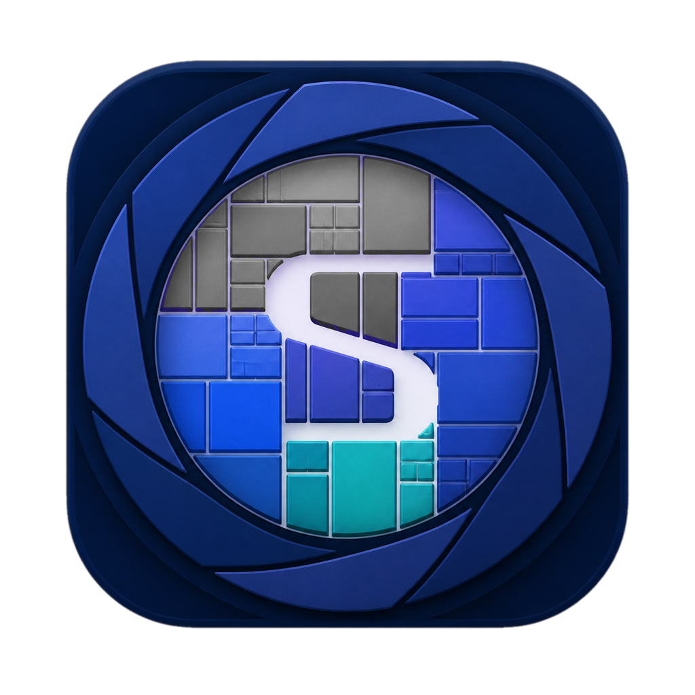
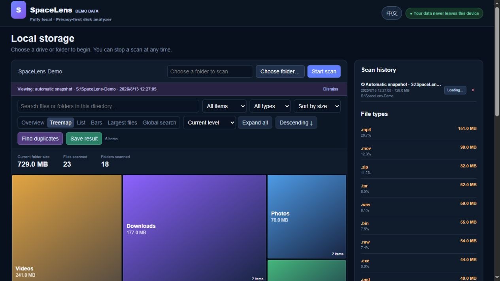
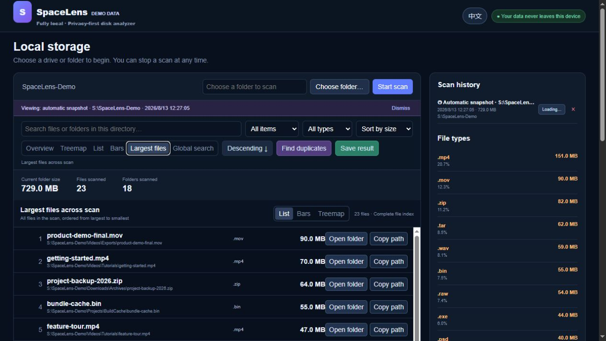
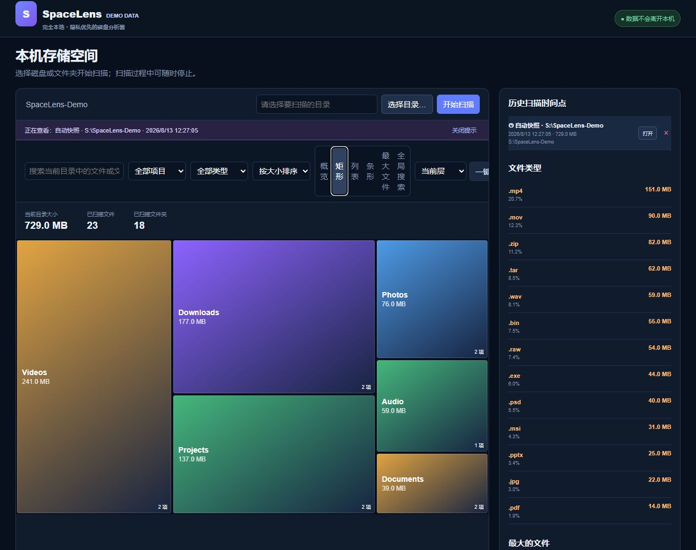
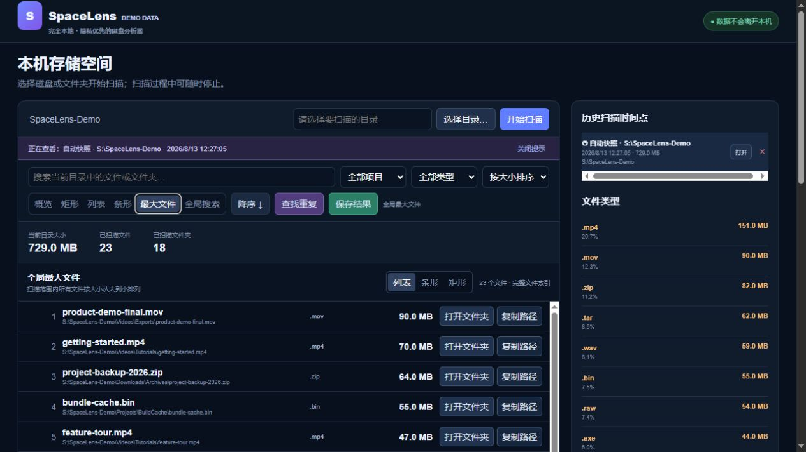

# SpaceLens

<p align="center">
  
</p>

**English** | [Chinese](#chinese)

[](https://github.com/koikpi/SpaceLens/releases/latest)
[](https://github.com/koikpi/SpaceLens/actions/workflows/build-cross-platform.yml)
[](LICENSE)
[](https://github.com/koikpi/SpaceLens/releases/latest)
[](https://github.com/koikpi/SpaceLens/releases/latest)

SpaceLens is a privacy-focused disk space analyzer that runs entirely on your computer. Its interactive treemap, directory list, and capacity bars help you find large files, duplicates, and reclaimable space.

**Fully local · No telemetry · Windows & macOS · MIT licensed**

[Download for Windows](https://github.com/koikpi/SpaceLens/releases/latest/download/SpaceLens-Windows-x64.zip) · [Download for macOS](https://github.com/koikpi/SpaceLens/releases/latest/download/SpaceLens-macOS-ARM64.dmg) · [Command-line install](#install-from-the-command-line)

## Interface preview





> These screenshots show the real SpaceLens application scanning a purpose-built synthetic demo folder. Every visible file name, path, and size is fictional and contains no user data.

## Downloads

- [Windows x64](https://github.com/koikpi/SpaceLens/releases/latest/download/SpaceLens-Windows-x64.zip) — most Intel/AMD Windows 10/11 PCs
- [Windows ARM64](https://github.com/koikpi/SpaceLens/releases/latest/download/SpaceLens-Windows-ARM64.zip) — ARM Windows devices such as Snapdragon PCs
- [macOS ARM64](https://github.com/koikpi/SpaceLens/releases/latest/download/SpaceLens-macOS-ARM64.dmg) — Apple Silicon Macs

On Windows, extract the entire ZIP and double-click `启动 SpaceLens.cmd`. On macOS, open the DMG and drag `SpaceLens.app` into Applications. Neither standalone build requires Python.

> [!IMPORTANT]
> **First launch on macOS:** the current macOS build is ad-hoc signed and has not been notarized by Apple, so Gatekeeper may say that Apple cannot verify SpaceLens. Click **Done** instead of moving the app to Trash, then open **System Settings → Privacy & Security**, scroll to **Security**, and click **Open Anyway** for SpaceLens. Enter your Mac password and confirm **Open**. You can also Control-click SpaceLens in Applications and choose **Open**. See [Apple's official guidance](https://support.apple.com/guide/mac-help/open-a-mac-app-from-an-unknown-developer-mh40616/mac) and the detailed [macOS instructions](MACOS.md). Only bypass this warning for the official download from this repository.

### Install from the command line

If Python 3.10+ is installed, [pipx](https://pipx.pypa.io/) can install and isolate SpaceLens directly from GitHub:

```bash
pipx install git+https://github.com/koikpi/SpaceLens.git
spacelens
```

Upgrade later with `pipx upgrade spacelens-disk-analyzer`, or uninstall with `pipx uninstall spacelens-disk-analyzer`. Package-manager releases for Homebrew and WinGet are planned once the project has a stable release history.

## Features

- Scan local disks, folders, external drives, and mounted network shares
- Explore usage with a treemap, hierarchy list, capacity bars, and large-file search
- Detect duplicate files using quick comparison, SHA-256, or byte-by-byte checks
- Save and reopen scan snapshots locally
- Reveal files in Windows Explorer or macOS Finder
- Native packages for Windows x64, Windows ARM64, and macOS ARM64

## Privacy and security

SpaceLens binds its local service to `127.0.0.1` only. It does not expose the service to your LAN or the internet, and it does not upload scan results, file names, paths, or disk information.

Scan data stays on your device:

- Windows: `%LOCALAPPDATA%\SpaceLens\saved_scans`
- macOS: `~/Library/Application Support/SpaceLens/saved_scans`

Scan snapshots, environment files, build caches, and release archives are excluded from Git. Before sharing logs, screenshots, or application data, check them for real file names and full local paths.

## Run from source

Python 3.10 or newer is required:

```bash
git clone https://github.com/koikpi/SpaceLens.git
cd SpaceLens
python local_server.py
```

The service starts at <http://127.0.0.1:8765> and opens your default browser. See [MACOS.md](MACOS.md) for first-launch security guidance and [CROSS_PLATFORM_TESTING.md](CROSS_PLATFORM_TESTING.md) for cross-platform packaging details.

## Web UI development

Node.js 22.13 or newer is required:

```bash
npm install
npm run dev
npm run lint
npm test
```

## License

[MIT License](LICENSE)

---

## Chinese

SpaceLens 是一款完全在本机运行的磁盘空间分析器。它通过矩形树图、目录列表和容量条帮助你发现大文件、重复文件和可清理空间。

## 界面预览





> 截图来自真实运行的 SpaceLens，但只扫描专门生成的合成演示目录。画面中的文件名、路径和容量均不属于真实用户数据。

## 下载

- [Windows x64](https://github.com/koikpi/SpaceLens/releases/latest/download/SpaceLens-Windows-x64.zip) — 适用于大多数 Intel/AMD Windows 10/11 电脑
- [Windows ARM64](https://github.com/koikpi/SpaceLens/releases/latest/download/SpaceLens-Windows-ARM64.zip) — 适用于 Snapdragon 等 ARM Windows 设备
- [macOS ARM64](https://github.com/koikpi/SpaceLens/releases/latest/download/SpaceLens-macOS-ARM64.dmg) — 适用于 Apple Silicon Mac

Windows 用户请解压整个 ZIP 后双击 `启动 SpaceLens.cmd`。macOS 用户请打开 DMG，并将 `SpaceLens.app` 拖入“应用程序”。独立版本均不需要安装 Python。

> [!IMPORTANT]
> **macOS 首次启动：** 当前 macOS 构建采用临时签名，尚未经过 Apple 公证，因此系统可能提示“Apple 无法验证 SpaceLens”。请点击**“完成”**，不要选择“移到废纸篓”；随后打开**“系统设置 → 隐私与安全性”**，向下滚动到“安全性”，找到 SpaceLens 并点击**“仍要打开”**，输入 Mac 登录密码后再次确认“打开”。也可以在“应用程序”中按住 Control 点击 SpaceLens，然后选择“打开”。参见 [Apple 官方说明](https://support.apple.com/zh-cn/guide/mac-help/mh40616/mac) 和项目的 [macOS 详细指南](MACOS.md)。仅应对本仓库官方 Release 下载的版本执行此操作。

### 从命令行安装

如果已安装 Python 3.10 或更高版本，可以用 [pipx](https://pipx.pypa.io/) 直接从 GitHub 安装并隔离运行环境：

```bash
pipx install git+https://github.com/koikpi/SpaceLens.git
spacelens
```

以后可用 `pipx upgrade spacelens-disk-analyzer` 升级，或用 `pipx uninstall spacelens-disk-analyzer` 卸载。等项目积累稳定版本后，再提交 Homebrew 和 WinGet 软件源会更合适。

## 功能

- 扫描本地磁盘、文件夹、外置磁盘和已挂载的网络共享
- 矩形树图、层级列表、容量条和大文件搜索
- 快速比较、SHA-256 和逐字节重复文件检测
- 保存并重新打开本地扫描快照
- 在 Windows 资源管理器或 macOS Finder 中定位文件
- 提供 Windows x64、Windows ARM64 和 macOS ARM64 独立安装包

## 隐私与安全

SpaceLens 的本地服务只监听 `127.0.0.1`，不会向局域网或互联网开放。SpaceLens 不会主动上传扫描结果或硬盘信息，包括文件名和路径。

扫描数据只保存在本机：

- Windows：`%LOCALAPPDATA%\SpaceLens\saved_scans`
- macOS：`~/Library/Application Support/SpaceLens/saved_scans`

`saved_scans/`、环境变量文件、构建缓存和发布压缩包均被 Git 忽略。分享日志、截图或程序数据目录前，仍请先检查其中是否含有真实文件名或完整路径。

## 从源码运行

需要 Python 3.10 或更高版本：

```bash
git clone https://github.com/koikpi/SpaceLens.git
cd SpaceLens
python local_server.py
```

服务会在 <http://127.0.0.1:8765> 启动并打开默认浏览器。macOS 的首次运行与系统安全提示说明见 [MACOS.md](MACOS.md)，跨平台构建说明见 [CROSS_PLATFORM_TESTING.md](CROSS_PLATFORM_TESTING.md)。

## Web 界面开发

需要 Node.js 22.13 或更高版本：

```bash
npm install
npm run dev
npm run lint
npm test
```

## 许可证

[MIT License](LICENSE)
